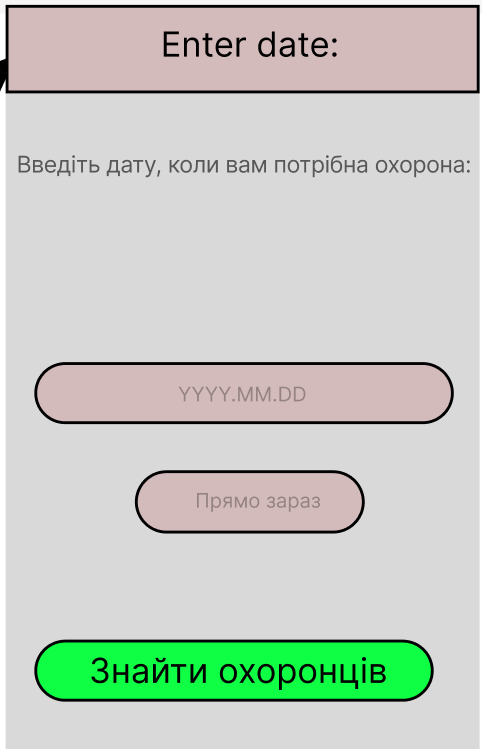
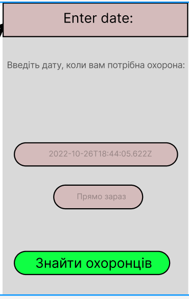
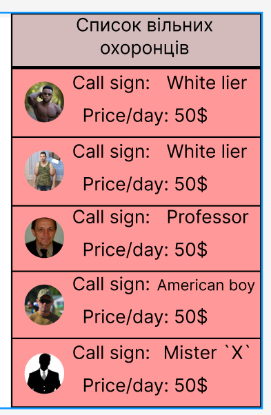

|   NFR id   | Test Case id  |                                                                  Опис кроків тестового сценарію                                                                  |                                                      Опис очікуваних результатів                                                      |
|:----------:|:-------------:|:----------------------------------------------------------------------------------------------------------------------------------------------------------------:|:-------------------------------------------------------------------------------------------------------------------------------------:|
|   NFR1.2   |     TC1.5     |                                                    Початкові умови: відсутні.   Кроки сценарію: відсутні.                                                     |  Екрана форма:      
|   NFR1.2   |     TC1.6     | Початкові умови: успішно пройдено TC1.5.   Кроки сценарію:   1) В поле «Дата» внесено значення 2022-10-26T18:44:05.622Z або натиснуто кнопку "прямо зараз" |  Екрана форма:      
|   NFR1.2   |     TC1.7     |                            Початкові умови: успішно пройдено TC1.6.   Кроки сценарію:   1) Натиснуто кнопку "знайти охоронців".                            |  Екрана форма:      